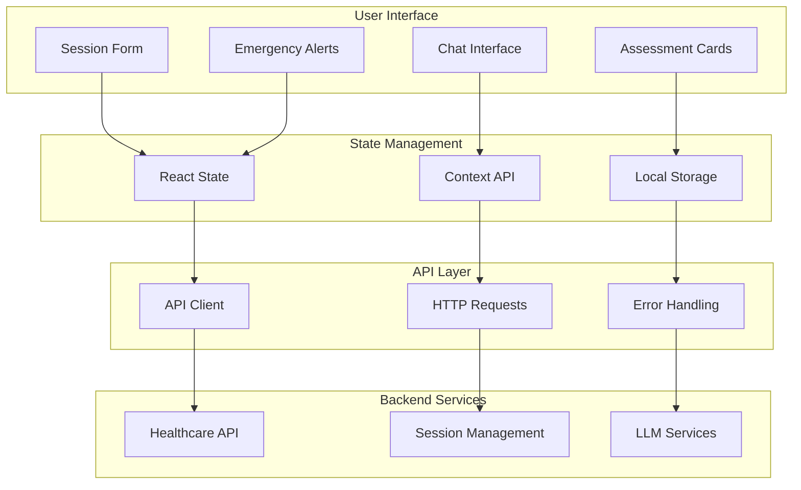
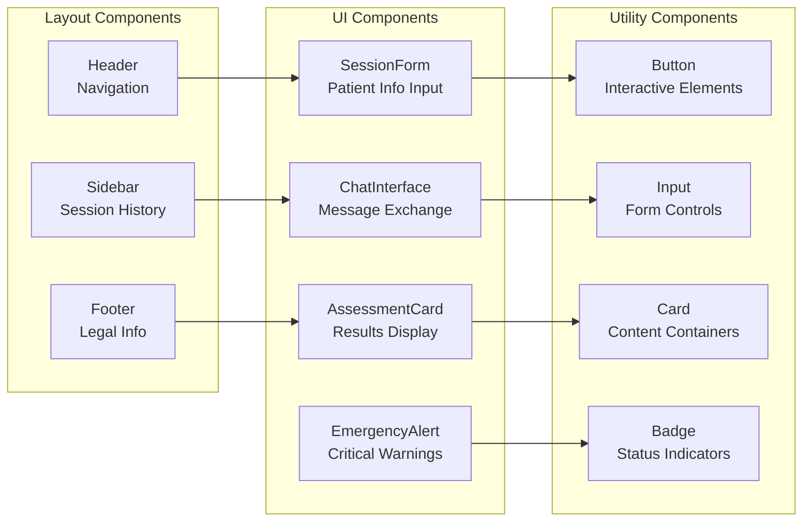

# 🏥 Healthcare Symptom Checker Frontend

<div align="center">


**Modern, responsive frontend for AI-powered medical symptom analysis**

[🚀 Quick Start](#-quick-start) • [📖 Documentation](#-documentation) • [🏗️ Architecture](#️-architecture) • [🔧 API Integration](#-api-integration) • [🚀 Deployment](#-deployment)

</div>

---

## 📋 Table of Contents

- [Overview](#-overview)
- [Features](#-features)
- [Architecture](#️-architecture)
- [Quick Start](#-quick-start)
- [API Integration](#-api-integration)
- [Components](#-components)
- [Styling](#-styling)
- [Deployment](#-deployment)
- [Development](#-development)
- [Contributing](#-contributing)

---

## 🎯 Overview

The Healthcare Symptom Checker Frontend is a modern, responsive web application built with Next.js, TypeScript, and Tailwind CSS. It provides an intuitive user interface for the AI-powered medical symptom analysis system, featuring real-time emergency detection, multi-turn conversations, and comprehensive health assessments.

### 🎯 Key Capabilities

- **🎨 Modern UI/UX**: Clean, professional design with responsive layout
- **🚨 Emergency Detection**: Real-time alerts for life-threatening conditions
- **💬 Interactive Chat**: Multi-turn conversation interface
- **📊 Health Assessments**: Comprehensive symptom analysis display
- **🔒 Type Safety**: Full TypeScript implementation
- **📱 Mobile Responsive**: Optimized for all device sizes

---

## ✨ Features

### 🚨 Emergency Detection UI
- **Real-time Alerts**: Immediate visual warnings for emergency conditions
- **Emergency Modal**: Prominent emergency notification system
- **Call-to-Action**: Direct 911 integration prompts
- **Severity Indicators**: Color-coded urgency levels

### 💬 Interactive Chat Interface
- **Session Management**: Create and manage health assessment sessions
- **Multi-turn Conversations**: Context-aware symptom discussions
- **Message History**: Complete conversation tracking
- **Typing Indicators**: Real-time user feedback

### 📊 Assessment Display
- **Condition Cards**: Detailed probable condition information
- **Confidence Scores**: Probability-based condition matching
- **Recommendations**: Evidence-based care suggestions
- **Body System Mapping**: Visual system categorization

### 🎨 Modern Design System
- **Component Library**: Reusable UI components
- **Dark/Light Mode**: Theme switching capability
- **Accessibility**: WCAG compliant design
- **Animations**: Smooth transitions and micro-interactions

---

## 🏗️ Architecture

### Frontend Architecture Diagram



### Component Architecture



---

## 🚀 Quick Start

### Prerequisites

- **Node.js 18+**
- **npm** or **yarn**
- **Healthcare Backend API** running

### 1. Clone Repository

```bash
git clone https://github.com/yourusername/healthcare-frontend.git
cd healthcare-frontend
```

### 2. Install Dependencies

```bash
npm install
# or
yarn install
```

### 3. Environment Setup

```bash
# Create environment file
cp .env.example .env.local

# Edit .env.local with your backend API URL
NEXT_PUBLIC_API_URL=http://localhost:8000
```

### 4. Run Development Server

```bash
npm run dev
# or
yarn dev
```

### 5. Access Application

Open [http://localhost:3000](http://localhost:3000) in your browser.

---

## 🔧 API Integration

### API Client Configuration

```typescript
// lib/api.ts
const API_BASE_URL = process.env.NEXT_PUBLIC_API_URL || 'http://localhost:8000'

export const apiClient = {
  // Start new session
  startSession: async (data: SessionRequest) => {
    const response = await fetch(`${API_BASE_URL}/api/symptom/start`, {
      method: 'POST',
      headers: { 'Content-Type': 'application/json' },
      body: JSON.stringify(data)
    })
    return response.json()
  },

  // Send symptom message
  sendMessage: async (data: SymptomMessage) => {
    const response = await fetch(`${API_BASE_URL}/api/symptom/message`, {
      method: 'POST',
      headers: { 'Content-Type': 'application/json' },
      body: JSON.stringify(data)
    })
    return response.json()
  },

  // Get conversation history
  getHistory: async (sessionId: string) => {
    const response = await fetch(`${API_BASE_URL}/api/history/${sessionId}`)
    return response.json()
  }
}
```

### Type Definitions

```typescript
// types/api.ts
export interface SessionRequest {
  age: number
  sex: string
  medical_history?: string[]
  medications?: string[]
  allergies?: string[]
}

export interface SymptomMessage {
  session_id: string
  message: string
  severity: number
  duration?: string
}

export interface Assessment {
  urgency: 'emergency' | 'urgent' | 'routine'
  emergency_warning?: string
  probable_conditions: Condition[]
  recommendations: string[]
  disclaimer: string
}
```

---

## 🧩 Components

### Core Components

#### SessionForm
```typescript
// components/SessionForm.tsx
interface SessionFormProps {
  onSubmit: (data: SessionRequest) => void
  loading?: boolean
}

const SessionForm: React.FC<SessionFormProps> = ({ onSubmit, loading }) => {
  // Form logic for patient information
  return (
    <Card>
      <form onSubmit={handleSubmit}>
        <Input label="Age" type="number" {...register('age')} />
        <Select label="Sex" {...register('sex')}>
          <option value="male">Male</option>
          <option value="female">Female</option>
        </Select>
        <Button type="submit" loading={loading}>
          Start Assessment
        </Button>
      </form>
    </Card>
  )
}
```

#### ChatInterface
```typescript
// components/ChatInterface.tsx
const ChatInterface: React.FC<ChatInterfaceProps> = ({ sessionId }) => {
  const [messages, setMessages] = useState<Message[]>([])
  
  const sendMessage = async (message: string, severity: number) => {
    const response = await apiClient.sendMessage({
      session_id: sessionId,
      message,
      severity
    })
    setMessages(prev => [...prev, response])
  }

  return (
    <div className="chat-container">
      {messages.map(message => (
        <MessageBubble key={message.id} message={message} />
      ))}
      <MessageInput onSend={sendMessage} />
    </div>
  )
}
```

#### EmergencyAlert
```typescript
// components/EmergencyAlert.tsx
const EmergencyAlert: React.FC<EmergencyAlertProps> = ({ assessment }) => {
  if (assessment.urgency !== 'emergency') return null

  return (
    <div className="emergency-alert">
      <AlertTriangle className="w-6 h-6 text-red-500" />
      <div>
        <h3>🚨 MEDICAL EMERGENCY DETECTED 🚨</h3>
        <p>{assessment.emergency_warning}</p>
        <Button variant="destructive" size="lg">
          Call 911 Immediately
        </Button>
      </div>
    </div>
  )
}
```

---

## 🎨 Styling

### Tailwind CSS Configuration

```javascript
// tailwind.config.js
module.exports = {
  content: [
    './pages/**/*.{js,ts,jsx,tsx,mdx}',
    './components/**/*.{js,ts,jsx,tsx,mdx}',
    './app/**/*.{js,ts,jsx,tsx,mdx}',
  ],
  theme: {
    extend: {
      colors: {
        primary: {
          50: '#eff6ff',
          500: '#3b82f6',
          600: '#2563eb',
          700: '#1d4ed8',
        },
        emergency: {
          50: '#fef2f2',
          500: '#ef4444',
          600: '#dc2626',
          700: '#b91c1c',
        }
      },
      animation: {
        'pulse-emergency': 'pulse 1s cubic-bezier(0.4, 0, 0.6, 1) infinite',
      }
    },
  },
  plugins: [],
}
```

### Component Styling

```css
/* styles/globals.css */
@tailwind base;
@tailwind components;
@tailwind utilities;

@layer components {
  .emergency-alert {
    @apply bg-red-50 border border-red-200 rounded-lg p-4 flex items-start space-x-3;
  }
  
  .chat-message {
    @apply max-w-xs lg:max-w-md px-4 py-2 rounded-lg;
  }
  
  .chat-message.user {
    @apply bg-primary-500 text-white ml-auto;
  }
  
  .chat-message.assistant {
    @apply bg-gray-100 text-gray-900;
  }
}
```

---

## 🚀 Deployment

### Vercel Deployment (Recommended)

1. **Connect Repository**:
   ```bash
   # Install Vercel CLI
   npm i -g vercel
   
   # Deploy
   vercel
   ```

2. **Environment Variables**:
   ```bash
   # Set in Vercel dashboard
   NEXT_PUBLIC_API_URL=https://your-backend-api.vercel.app
   ```

3. **Automatic Deployments**:
   - Push to `main` branch triggers automatic deployment
   - Preview deployments for pull requests

### Netlify Deployment

1. **Build Configuration**:
   ```toml
   # netlify.toml
   [build]
     command = "npm run build"
     publish = ".next"
   
   [build.environment]
     NODE_VERSION = "18"
   ```

2. **Deploy**:
   ```bash
   # Install Netlify CLI
   npm i -g netlify-cli
   
   # Deploy
   netlify deploy --prod
   ```

### Docker Deployment

```dockerfile
# Dockerfile
FROM node:18-alpine AS deps
WORKDIR /app
COPY package*.json ./
RUN npm ci --only=production

FROM node:18-alpine AS builder
WORKDIR /app
COPY . .
COPY --from=deps /app/node_modules ./node_modules
RUN npm run build

FROM node:18-alpine AS runner
WORKDIR /app
ENV NODE_ENV production
COPY --from=builder /app/public ./public
COPY --from=builder /app/.next/standalone ./
COPY --from=builder /app/.next/static ./.next/static

EXPOSE 3000
CMD ["node", "server.js"]
```

---

## 🛠️ Development

### Project Structure

```
healthcare-frontend/
├── app/                    # Next.js 13+ app directory
│   ├── globals.css        # Global styles
│   ├── layout.tsx         # Root layout
│   └── page.tsx           # Home page
├── components/            # React components
│   ├── ui/               # Base UI components
│   │   ├── Button.tsx
│   │   ├── Input.tsx
│   │   ├── Card.tsx
│   │   └── Badge.tsx
│   ├── SessionForm.tsx   # Patient info form
│   ├── ChatInterface.tsx # Chat component
│   ├── AssessmentCard.tsx # Results display
│   └── EmergencyAlert.tsx # Emergency warnings
├── lib/                  # Utility functions
│   ├── api.ts           # API client
│   └── utils.ts         # Helper functions
├── types/               # TypeScript definitions
│   └── api.ts          # API types
├── hooks/              # Custom React hooks
│   └── useApi.ts      # API hook
├── styles/             # Additional styles
├── public/             # Static assets
├── package.json
├── tailwind.config.js
├── tsconfig.json
└── next.config.js
```

### Available Scripts

```bash
# Development
npm run dev          # Start development server
npm run build        # Build for production
npm run start        # Start production server
npm run lint         # Run ESLint
npm run type-check   # Run TypeScript checks

# Testing
npm run test         # Run tests
npm run test:watch   # Run tests in watch mode
npm run test:coverage # Run tests with coverage
```

### Code Quality

```bash
# Pre-commit hooks
npm run prepare      # Install husky hooks
npm run lint:fix     # Fix linting issues
npm run format       # Format code with Prettier
```

---

## 🧪 Testing

### Component Testing

```typescript
// __tests__/SessionForm.test.tsx
import { render, screen, fireEvent } from '@testing-library/react'
import { SessionForm } from '../components/SessionForm'

describe('SessionForm', () => {
  it('submits form with valid data', async () => {
    const mockSubmit = jest.fn()
    render(<SessionForm onSubmit={mockSubmit} />)
    
    fireEvent.change(screen.getByLabelText('Age'), { target: { value: '30' } })
    fireEvent.change(screen.getByLabelText('Sex'), { target: { value: 'male' } })
    fireEvent.click(screen.getByText('Start Assessment'))
    
    expect(mockSubmit).toHaveBeenCalledWith({
      age: 30,
      sex: 'male',
      medical_history: [],
      medications: [],
      allergies: []
    })
  })
})
```

### API Integration Testing

```typescript
// __tests__/api.test.ts
import { apiClient } from '../lib/api'

describe('API Client', () => {
  it('creates session successfully', async () => {
    const sessionData = {
      age: 30,
      sex: 'male'
    }
    
    const result = await apiClient.startSession(sessionData)
    expect(result.session_id).toBeDefined()
  })
})
```

---

## 📊 Performance

### Optimization Features

- **Next.js 13+ App Router**: Latest routing and rendering optimizations
- **Image Optimization**: Automatic image optimization with `next/image`
- **Code Splitting**: Automatic code splitting for optimal loading
- **Static Generation**: Pre-rendered pages for better performance
- **Bundle Analysis**: Built-in bundle analyzer

### Performance Monitoring

```typescript
// lib/analytics.ts
export const trackPerformance = (metric: string, value: number) => {
  if (typeof window !== 'undefined') {
    // Send to analytics service
    gtag('event', 'performance', {
      metric_name: metric,
      value: value
    })
  }
}
```

---

## 🔒 Security

### Security Features

- **Input Validation**: Client-side validation with TypeScript
- **XSS Protection**: React's built-in XSS protection
- **CSRF Protection**: SameSite cookies and CSRF tokens
- **Content Security Policy**: Strict CSP headers
- **Environment Variables**: Secure API key management

### Security Headers

```javascript
// next.config.js
module.exports = {
  async headers() {
    return [
      {
        source: '/(.*)',
        headers: [
          {
            key: 'X-Frame-Options',
            value: 'DENY',
          },
          {
            key: 'X-Content-Type-Options',
            value: 'nosniff',
          },
          {
            key: 'Referrer-Policy',
            value: 'strict-origin-when-cross-origin',
          },
        ],
      },
    ]
  },
}
```

---

## 🤝 Contributing

### Development Workflow

1. **Fork** the repository
2. **Create** a feature branch: `git checkout -b feature/amazing-feature`
3. **Commit** your changes: `git commit -m 'Add amazing feature'`
4. **Push** to the branch: `git push origin feature/amazing-feature`
5. **Open** a Pull Request

### Code Standards

- **TypeScript**: Use TypeScript for all new code
- **ESLint**: Follow the configured ESLint rules
- **Prettier**: Use Prettier for code formatting
- **Testing**: Add tests for new features
- **Documentation**: Update README for significant changes

### Pull Request Template

```markdown
## Description
Brief description of changes

## Type of Change
- [ ] Bug fix
- [ ] New feature
- [ ] Breaking change
- [ ] Documentation update

## Testing
- [ ] Tests pass locally
- [ ] New tests added
- [ ] Manual testing completed

## Screenshots
Add screenshots for UI changes

## Checklist
- [ ] Code follows style guidelines
- [ ] Self-review completed
- [ ] Documentation updated
```

---

## 📄 License

This project is licensed under the MIT License - see the [LICENSE](LICENSE) file for details.

---

## 🆘 Support

### Getting Help

- **Documentation**: Check this README and component docs
- **Issues**: Create a GitHub issue for bugs
- **Discussions**: Use GitHub Discussions for questions
- **Email**: Contact the development team

### Common Issues

#### Build Errors
```bash
# Clear Next.js cache
rm -rf .next
npm run build
```

#### API Connection Issues
```bash
# Check environment variables
echo $NEXT_PUBLIC_API_URL

# Test API connectivity
curl $NEXT_PUBLIC_API_URL/api/health
```

#### TypeScript Errors
```bash
# Check TypeScript configuration
npx tsc --noEmit

# Update type definitions
npm run type-check
```

---

## 🎯 Roadmap

### Upcoming Features

- [ ] **Dark Mode**: Theme switching capability
- [ ] **Offline Support**: Service worker implementation
- [ ] **Push Notifications**: Real-time updates
- [ ] **Voice Input**: Speech-to-text integration
- [ ] **Multi-language**: Internationalization support
- [ ] **Advanced Analytics**: User behavior tracking
- [ ] **PWA Support**: Progressive Web App features
- [ ] **Accessibility**: Enhanced WCAG compliance

### Version History

- **v1.0.0** (Current): Core functionality with emergency detection
- **v1.1.0** (Planned): Dark mode and theme customization
- **v1.2.0** (Planned): Voice input and accessibility improvements
- **v2.0.0** (Planned): PWA and offline support

---

<div align="center">

**Built with ❤️ for better healthcare accessibility**

[](https://github.com/yourusername/healthcare-frontend)
[](https://github.com/yourusername/healthcare-frontend)
[](https://github.com/yourusername/healthcare-frontend/issues)

</div>