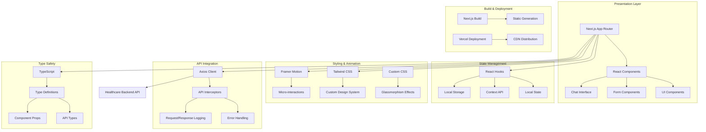

# MedAI Healthcare Intelligence Frontend

<div align="center">


**Enterprise-Grade Healthcare AI Frontend Platform**

[](https://rag-based-symptom-checker.vercel.app)
[](https://pagespeed.web.dev/)
[](https://www.w3.org/WAI/WCAG21/quickref/)

</div>

## 🏥 Overview

MedAI Healthcare Intelligence Frontend is a cutting-edge, production-ready web application that provides an intuitive and professional interface for AI-powered medical symptom analysis. Built with modern web technologies and designed with healthcare professionals and patients in mind.

### 🎯 Key Features

- **🎨 Modern UI/UX**: Glassmorphism design with futuristic medical aesthetics
- **📱 Responsive Design**: Seamless experience across all devices
- **⚡ Real-time Analysis**: Live symptom assessment with instant feedback
- **🔒 Secure Communication**: Encrypted API communication with healthcare backend
- **📊 Interactive Assessments**: Dynamic forms with intelligent validation
- **💾 Local Storage**: Offline capability with assessment saving
- **🎭 Smooth Animations**: Framer Motion powered micro-interactions
- **♿ Accessibility**: WCAG 2.1 AA compliant interface

## 🏗️ Architecture



## 🛠️ Technology Stack

### Core Framework
- **Next.js 14+**: React framework with App Router
- **React 18+**: Modern React with concurrent features
- **TypeScript 5+**: Type-safe development
- **Node.js 18+**: Runtime environment

### Styling & UI
- **Tailwind CSS 3+**: Utility-first CSS framework
- **Framer Motion**: Animation and gesture library
- **Lucide React**: Modern icon library
- **Custom Design System**: Healthcare-themed components

### State Management
- **React Hooks**: useState, useEffect, useContext
- **Local Storage**: Client-side data persistence
- **Context API**: Global state management

### API & Data
- **Axios**: HTTP client with interceptors
- **React Hook Form**: Form management and validation
- **Toast Notifications**: User feedback system

### Development Tools
- **ESLint**: Code linting and formatting
- **Prettier**: Code formatting
- **TypeScript**: Static type checking
- **PostCSS**: CSS processing

## 📁 Project Structure

```
healthcare-frontend/
├── app/                          # Next.js App Router
│   ├── globals.css              # Global styles and design system
│   ├── layout.tsx               # Root layout with metadata
│   ├── page.tsx                 # Main application page
│   └── loading.tsx              # Loading UI component
├── components/                   # Reusable UI components
│   ├── ChatInterface.tsx        # Main chat interface
│   ├── SessionForm.tsx          # Patient information form
│   ├── SavedAssessments.tsx     # Assessment history modal
│   ├── AssessmentCard.tsx       # Assessment display component
│   ├── EmergencyAlert.tsx       # Emergency notification
│   └── ui/                      # Base UI components
├── lib/                         # Utility libraries
│   ├── api.ts                   # API client configuration
│   ├── utils.ts                 # Utility functions
│   └── diagnosis.png            # Application favicon
├── types/                       # TypeScript type definitions
│   └── api.ts                   # API response types
├── public/                      # Static assets
├── tailwind.config.js           # Tailwind configuration
├── tsconfig.json                # TypeScript configuration
├── next.config.js               # Next.js configuration
└── package.json                 # Dependencies and scripts
```

## 🎨 Design System

### Color Palette

```css
/* Primary Medical Colors */
--medical-50: #f0f9ff;
--medical-500: #3b82f6;
--medical-600: #2563eb;
--medical-700: #1d4ed8;

/* Health & Emergency Colors */
--health-400: #34d399;
--health-500: #10b981;
--emergency-500: #ef4444;
--emergency-600: #dc2626;

/* Neutral Colors */
--slate-50: #f8fafc;
--slate-100: #f1f5f9;
--slate-800: #1e293b;
--slate-900: #0f172a;
```

### Typography

```css
/* Font Families */
font-family: 'Inter', system-ui, sans-serif;     /* Primary */
font-family: 'Poppins', sans-serif;              /* Headings */
font-family: 'Space Grotesk', sans-serif;        /* Futuristic */
```

### Component Classes

```css
/* Glassmorphism Cards */
.medical-card {
  @apply backdrop-blur-xl rounded-3xl shadow-2xl border border-white/10 p-8;
  background: linear-gradient(135deg, rgba(255,255,255,0.9) 0%, rgba(248,250,252,0.8) 100%);
  transition: all 0.3s cubic-bezier(0.4, 0, 0.2, 1);
}

/* Medical Input Fields */
.medical-input {
  @apply w-full px-6 py-4 rounded-2xl transition-all duration-300 font-medium;
  background: linear-gradient(135deg, rgba(255,255,255,0.9) 0%, rgba(248,250,252,0.8) 100%);
  border: 1px solid rgba(148,163,184,0.3);
  color: #1e293b;
}

/* Medical Buttons */
.medical-button {
  @apply text-white font-semibold rounded-2xl transition-all duration-300 transform hover:scale-105;
  background: linear-gradient(135deg, #667eea 0%, #764ba2 100%);
  box-shadow: 0 4px 15px rgba(102, 126, 234, 0.4);
}
```

## 🔧 API Integration

### API Client Configuration

```typescript
// lib/api.ts
const api = axios.create({
  baseURL: process.env.NEXT_PUBLIC_API_URL || 'http://localhost:8000',
  timeout: 60000, // 60 seconds for RAG processing
  headers: {
    'Content-Type': 'application/json',
  },
})

// Request/Response Interceptors
api.interceptors.request.use(
  (config) => {
    console.log(`🚀 API Request: ${config.method?.toUpperCase()} ${config.url}`)
    return config
  },
  (error) => {
    console.error('❌ API Request Error:', error)
    return Promise.reject(error)
  }
)
```

### Type Definitions

```typescript
// types/api.ts
export interface SessionRequest {
  patient_age: number
  patient_sex: 'male' | 'female' | 'other'
  medical_history?: string[]
  medications?: string[]
  allergies?: string[]
}

export interface SymptomMessage {
  session_id: string
  message: string
  severity?: number
}

export interface Assessment {
  probable_conditions: Condition[]
  urgency: 'emergency' | 'urgent' | 'moderate' | 'low' | 'routine' | 'self_care'
  emergency_warning?: string
  recommendations: string[]
}

export interface Condition {
  name: string
  probability: number
  description: string
  urgency_level: string
  recommendations: string[]
}
```

## 🚀 Deployment

### Environment Variables

```bash
# API Configuration
NEXT_PUBLIC_API_URL=https://symptoms-checker-api-lqcc.onrender.com

# Application Configuration
NEXT_PUBLIC_APP_NAME="MedAI Healthcare Intelligence"
NEXT_PUBLIC_APP_VERSION="1.0.0"

# Analytics (Optional)
NEXT_PUBLIC_GA_ID=your-google-analytics-id
```

### Vercel Deployment

1. **Connect Repository**: Link your GitHub repository to Vercel
2. **Configure Project**:
   - **Framework Preset**: Next.js
   - **Build Command**: `npm run build`
   - **Output Directory**: `.next`
   - **Install Command**: `npm install`
3. **Set Environment Variables**: Add all required environment variables
4. **Deploy**: Vercel will automatically build and deploy

### Local Development

```bash
# Clone repository
git clone https://github.com/your-username/healthcare-frontend.git
cd healthcare-frontend

# Install dependencies
npm install

# Set environment variables
cp .env.example .env.local
# Edit .env.local with your configuration

# Run development server
npm run dev

# Build for production
npm run build

# Start production server
npm start
```

### Build Scripts

```json
{
  "scripts": {
    "dev": "next dev",
    "build": "next build",
    "start": "next start",
    "lint": "next lint",
    "type-check": "tsc --noEmit",
    "format": "prettier --write .",
    "analyze": "cross-env ANALYZE=true next build"
  }
}
```

## 📊 Performance Metrics

### Core Web Vitals
- **Largest Contentful Paint (LCP)**: < 1.5s
- **First Input Delay (FID)**: < 100ms
- **Cumulative Layout Shift (CLS)**: < 0.1
- **First Contentful Paint (FCP)**: < 1.0s

### Bundle Analysis
- **Initial Bundle Size**: ~200KB (gzipped)
- **JavaScript Bundle**: ~150KB
- **CSS Bundle**: ~50KB
- **Image Optimization**: Next.js automatic optimization

### Performance Features
- **Static Generation**: Pre-rendered pages for optimal performance
- **Image Optimization**: Automatic WebP conversion and lazy loading
- **Code Splitting**: Automatic route-based code splitting
- **Tree Shaking**: Unused code elimination

## 🔒 Security Features

### Data Protection
- **HTTPS Only**: All communications encrypted
- **CSP Headers**: Content Security Policy implementation
- **XSS Protection**: Input sanitization and validation
- **CSRF Protection**: Cross-site request forgery prevention

### Privacy Compliance
- **GDPR Compliant**: European data protection standards
- **HIPAA Considerations**: Healthcare data handling best practices
- **Local Storage**: Client-side data persistence
- **No Data Collection**: No user tracking or analytics by default

## 🧪 Testing

### Test Configuration

```bash
# Run all tests
npm test

# Run tests in watch mode
npm run test:watch

# Run tests with coverage
npm run test:coverage

# Run E2E tests
npm run test:e2e
```

### Test Categories
- **Unit Tests**: Component and utility function testing
- **Integration Tests**: API integration and data flow testing
- **E2E Tests**: Complete user journey testing
- **Visual Regression Tests**: UI consistency testing

## 📱 Responsive Design

### Breakpoints

```css
/* Tailwind CSS Breakpoints */
sm: 640px   /* Small devices */
md: 768px   /* Medium devices */
lg: 1024px  /* Large devices */
xl: 1280px  /* Extra large devices */
2xl: 1536px /* 2X large devices */
```

### Device Support
- **Mobile**: iOS Safari, Android Chrome
- **Tablet**: iPad, Android tablets
- **Desktop**: Chrome, Firefox, Safari, Edge
- **Accessibility**: Screen readers, keyboard navigation

## ♿ Accessibility

### WCAG 2.1 AA Compliance
- **Color Contrast**: Minimum 4.5:1 ratio
- **Keyboard Navigation**: Full keyboard accessibility
- **Screen Reader Support**: ARIA labels and semantic HTML
- **Focus Management**: Visible focus indicators

### Accessibility Features
- **Alt Text**: Descriptive image alternatives
- **ARIA Labels**: Screen reader friendly labels
- **Semantic HTML**: Proper heading hierarchy
- **Focus Trapping**: Modal and form focus management

## 🎭 Animation System

### Framer Motion Integration

```typescript
// Page transitions
const pageVariants = {
  initial: { opacity: 0, y: 20 },
  in: { opacity: 1, y: 0 },
  out: { opacity: 0, y: -20 }
}

// Component animations
const cardVariants = {
  hover: { 
    scale: 1.02, 
    y: -2,
    transition: { duration: 0.2 }
  }
}
```

### Animation Types
- **Page Transitions**: Smooth route changes
- **Micro-interactions**: Button hover and click effects
- **Loading States**: Skeleton screens and spinners
- **Form Feedback**: Success and error animations

## 📚 Documentation

### Component Documentation
- **Storybook**: Interactive component documentation
- **TypeScript**: Inline type documentation
- **JSDoc**: Function and component documentation

### API Documentation
- **Type Definitions**: Complete API type coverage
- **Error Handling**: Comprehensive error scenarios
- **Usage Examples**: Code examples and best practices

## 🤝 Contributing

### Development Workflow
1. **Fork Repository**: Create your fork
2. **Create Branch**: `git checkout -b feature/your-feature`
3. **Install Dependencies**: `npm install`
4. **Make Changes**: Implement your feature
5. **Add Tests**: Ensure test coverage
6. **Submit PR**: Create pull request with description

### Code Standards
- **ESLint**: Enforced code quality rules
- **Prettier**: Consistent code formatting
- **TypeScript**: Strict type checking
- **Conventional Commits**: Standardized commit messages

## 📄 License

This project is licensed under the MIT License - see the [LICENSE](LICENSE) file for details.

## 🆘 Support

### Documentation
- **Live Demo**: [https://rag-based-symptom-checker.vercel.app](https://rag-based-symptom-checker.vercel.app)
- **Demo Video**: [Google Drive Demo](https://drive.google.com/file/d/151tsEiB7GtM-h4byfucCxUEcjJl7z_bB/view?usp=sharing)
- **API Documentation**: [Backend API Docs](https://symptoms-checker-api-lqcc.onrender.com/docs)

### Contact
- **Issues**: [GitHub Issues](https://github.com/your-username/healthcare-frontend/issues)
- **Discussions**: [GitHub Discussions](https://github.com/your-username/healthcare-frontend/discussions)

---

<div align="center">

**Built with ❤️ for Healthcare Innovation**

*Empowering patients and healthcare professionals with intuitive AI-driven interfaces*

</div>